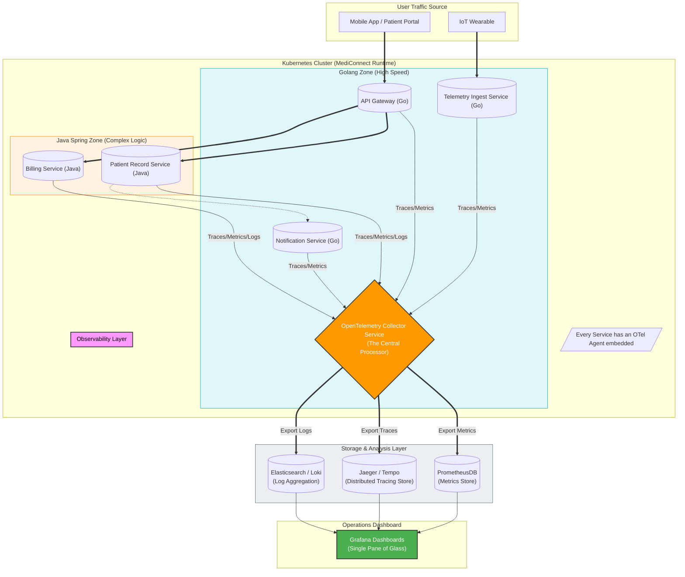

```mermaid
graph TD
    subgraph CLIENTS ["User Traffic Source"]
        MobileApp[Mobile App / Patient Portal]
        IoTDevice[IoT Wearable]
    end

    subgraph KUBERNETES_CLUSTER ["Kubernetes Cluster (MediConnect Runtime)"]
        note[/" Every Service has an OTel Agent embedded "/]

        subgraph GO_ZONE ["Golang Zone (High Speed)"]
            Gateway[("API Gateway (Go)")]
            Notify[("Notification Service (Go)")]
            TelemetryIngest[("Telemetry Ingest Service (Go)")]
            
            %% Simulate OTel SDK inside Go apps
            Gateway -- "Traces/Metrics" --> OTelCol
            Notify -- "Traces/Metrics" --> OTelCol
            TelemetryIngest -- "Traces/Metrics" --> OTelCol
        end

        subgraph JAVA_ZONE ["Java Spring Zone (Complex Logic)"]
            PatientSVC[("Patient Record Service (Java)")]
            BillingSVC[("Billing Service (Java)")]
            
            %% Simulate OTel Agent inside Java apps
            PatientSVC -- "Traces/Metrics/Logs" --> OTelCol
            BillingSVC -- "Traces/Metrics/Logs" --> OTelCol
        end
        
        %% Traffic Flow (Application Logic)
        MobileApp ==> Gateway
        IoTDevice ==> TelemetryIngest
        Gateway ==> PatientSVC
        Gateway ==> BillingSVC
        PatientSVC -.-> Notify

        subgraph OTEL_HUB ["Observability Layer"]
            OTelCol{"OpenTelemetry Collector Service
            (The Central Processor)"}
        end
    end

    subgraph STORAGE_BACKENDS ["Storage & Analysis Layer"]
        Prometheus[("PrometheusDB
        (Metrics Store)")]
        Jaeger[("Jaeger / Tempo
        (Distributed Tracing Store)")]
        Elastic[("Elasticsearch / Loki
        (Log Aggregation)")]
    end

    subgraph VISUALIZATION ["Operations Dashboard"]
        Grafana["Grafana Dashboards
        (Single Pane of Glass)"]
    end

    %% OTel Flow (Data Export)
    OTelCol == "Export Metrics" ==> Prometheus
    OTelCol == "Export Traces" ==> Jaeger
    OTelCol == "Export Logs" ==> Elastic

    %% Visualization Connections
    Prometheus --> Grafana
    Jaeger --> Grafana
    Elastic --> Grafana

    %% Styling
    style OTEL_HUB fill:#f9f,stroke:#333,stroke-width:2px,color:black
    style OTelCol fill:#ff9900,stroke:#333,stroke-width:2px,color:white
    style GO_ZONE fill:#e0f7fa,stroke:#00acc1
    style JAVA_ZONE fill:#fff3e0,stroke:#fb8c00
    style STORAGE_BACKENDS fill:#eceff1,stroke:#546e7a
    style Grafana fill:#4caf50,stroke:#333,stroke-width:2px,color:white
```
