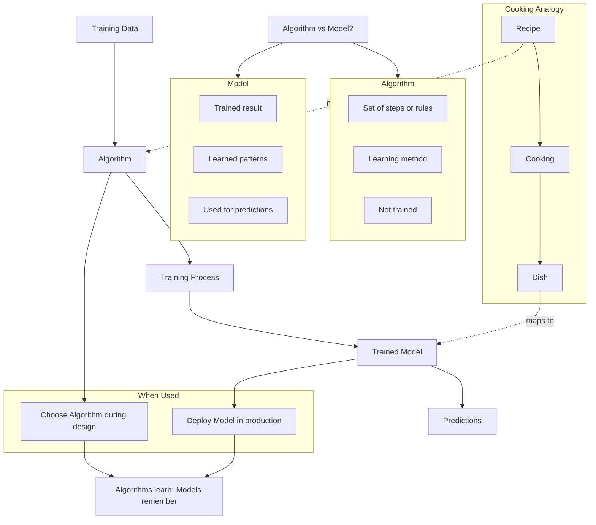

```mermaid
flowchart TD
    %% Whiteboard teaching: Algorithm vs Model

    Q[Algorithm vs Model?]

    subgraph A[Algorithm]
        A1[Set of steps or rules]
        A2[Learning method]
        A3[Not trained]
    end

    subgraph M[Model]
        M1[Trained result]
        M2[Learned patterns]
        M3[Used for predictions]
    end

    Q --> A
    Q --> M

    %% Training pipeline
    D[Training Data] --> ALG[Algorithm]
    ALG --> TR[Training Process]
    TR --> TM[Trained Model]
    TM --> P[Predictions]

    %% Cooking analogy
    subgraph AN[Cooking Analogy]
        R[Recipe] --> C[Cooking] --> DISH[Dish]
    end

    R -. maps to .-> ALG
    DISH -. maps to .-> TM

    %% When used
    subgraph W[When Used]
        WA[Choose Algorithm during design]
        WM[Deploy Model in production]
    end

    ALG --> WA
    TM --> WM

    %% Final takeaway
    T[Algorithms learn; Models remember]
    WA --> T
    WM --> T

```
